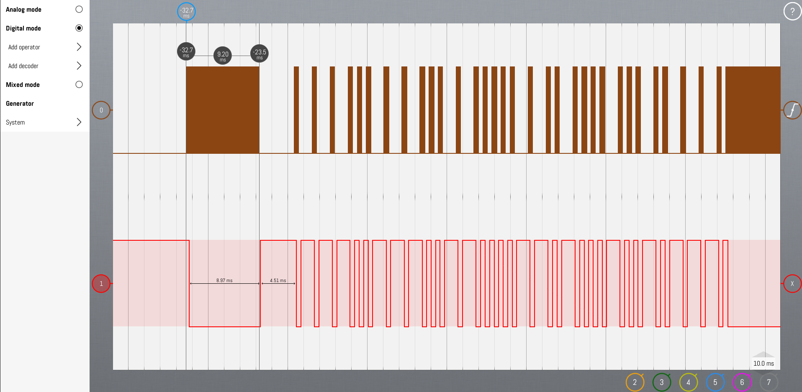
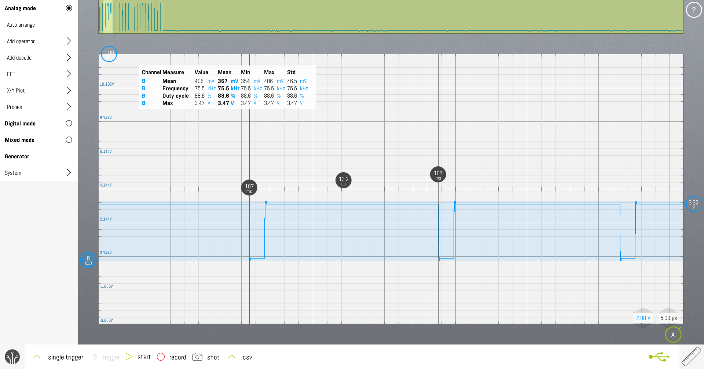

# M5Stick の赤外線リモコン化
## 目次

1. プロトコルの理解 [参考 : ](http://elm-chan.org/docs/ir_format.html)
2. HW の理解
3. 正規のリモコンからデータを取得する
4. データを送信する
   1. フォーマット通りに送信する 
   2. データを送信
      
## プロトコルの理解 

### 送信波

送信波周波数で基本となる信号を作り、振幅を 0, 1 でマスクして送信する。赤外線リモコンは 38kHz で送信する AM 変調の赤外線信号ということになります。受信側はまず 38kHz で変化する信号を選択することでその他の赤外線と区別してリモコンからの信号だけ受け取れます。あとは通信フォーマットに応じて解釈します。

### 通信フォーマット

[参考 :赤外線リモコンの通信フォーマット](http://elm-chan.org/docs/ir_format.html)

日本製品を使っている場合は上記サイトの情報を参考にすれば問題ない。海外製品の場合は検索すればいくつか候補に挙がると思う。ただ、大きく変える必要もないので先行していた日本のリモコンとフォーマットは大差ないだろうと思う。

もしTCP/IP を知っているならばフレームという単語に馴染みがあると思います。赤外線リモコンもフレームの中に特定のフォーマットでデータが埋め込まれています。兎にも角にもフレームの"Leader"が開始の合図なのでこれを検出して、あとはフォーマットに応じて解釈するということになります。

NEC, AEHA フォーマットは複数の会社で共用するのでまず識別番号があって、データを送っています。SONYフォーマットは 7 bit のデータとアドレスとなっています。

データそのものはいずれもLow/High 期間の比によって0, 1が決まっています。単純にHigh を 1、Low を 0 に出来ないのは完全に非同期で不安定な環境でも出来る限り正確にデータを送受信するためでしょう。

## HW の理解
### M5Stick の GPIP はどうやって 38kHzで動かすのか
#### そもそも38kHzで動くのか

 ESP32(CPU)のクロックが240MHz [SwitchScience 商品情報](https://www.switch-science.com/products/9350)

#### 既存のライブラリ[IRsend](https://github.com/Arduino-IRremote/Arduino-IRremote/blob/master/src/IRSend.hpp)

こちらも GPIO を直接動かしているので、この点だけでもプログラムから直接ドライブ可能だと判断できます。
      
#### オシロスコープで確認

もちろん実際に38kHz(26uS周期)の倍の周波数でGPIOを駆動できていることが波形からも確認できます。

#### M5 の IR Remote 回路図

[公式ドキュメント](https://docs.m5stack.com/en/unit/ir)
- 回路図

- 受信 IC
[IRM-3638T](https://www.mouser.jp/datasheet/2/143/EVER_S_A0007513414_1-2548705.pdf)

ブロックダイヤグラムから 38kHz の搬送波はフィルタリング（検波）されて信号があれば Low, 信号が無ければ High となって INPUT に出てくるので、結局 570uSec程度のトグルをCPUで検出できれば受信ができる
      - 出力
         GPIO を 38kHzでトグルさせる必要がある

### 正規のリモコンからデータを取得する
#### IR Remote の回路図から INPUT Port (G33) をloop()で読み取る 

      setup() は起動時に実行する内容を記述

      loop() は起動中繰り返し実行する内容を記述

   2. サンプリング定理とリモコンのプロトコルから 1/(570x10^-6[sec]) x 2 よりもGPIOのデータを読み取れれば良い
   
      受信結果は Serial で VS code の端末へ出力する
   
   3. 受信波形
      

   4. データのフォーマット解析

      人力で解析する。今回は NEC フォーマットだった。 

## 失敗の実例

ここが本当に大事な箇所で面白い項目のはず。

   1. 出力波形を出すループの中で Serial/Display IO 出力もしていた
   2. サンプリングする粒度が荒くて結果がそのままでは使えない可能性
   3. ロジックアナライザに入力するケーブルの断線で測定できていなかった
